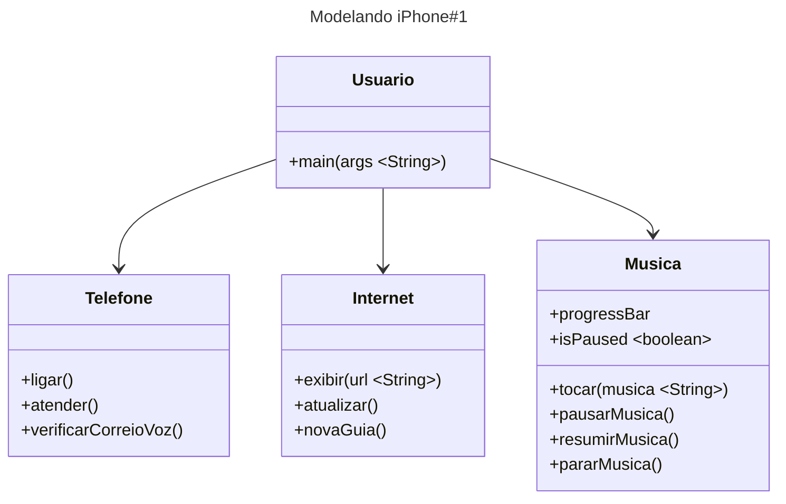

# dio-modelando-iPhone-java
Diagramação das classes e interfaces com a proposta de representar os papéis do iPhone de: Reprodutor Musical, Aparelho Telefônico e Navegador na Internet

https://mermaid-js.github.io/mermaid/#/
