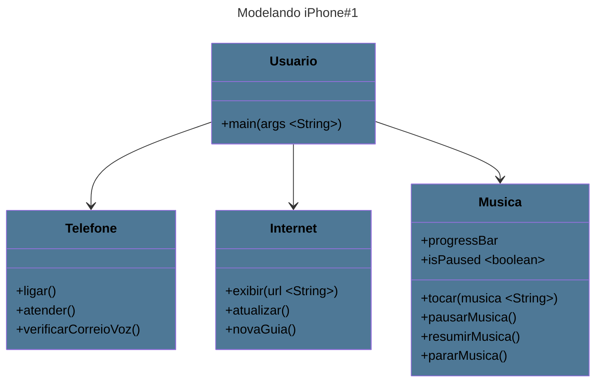

# dio-modelando-iPhone-java 
#### Olá, _Javeiros_. Este repositório é resultado de um desafio de código do curso de Java Básico da Digital Inovation One (DIO), focado no aprimoramento de habilidades com a Linguagem de Modelagem Unificada (UML). O objetivo foi criar diagramas que representassem os papéis do iPhone como Reprodutor Musical, Aparelho Telefônico e Navegador na Internet. Além disso, desenvolvi um _software_ básico para simular essas funções, utilizando a biblioteca _Swing_ para a interface gráfica, com a qual tenho mais afinidade. Estou muito satisfeito com o resultado, e este foi, até agora, o projeto Java em que mais me dediquei. Espero que vocês gostem também! :)
#### Abaixo, você encontrará o diagrama UML do projeto.
---

---

### _Gostou do meu perfil? Você pode saber mais sobre mim em:_ &nbsp;&nbsp;
### _Ou me contatar através do:_ &nbsp;&nbsp;
### _Referências:_
<https://felipe-aguiar.gitbook.io/dio-java>

<https://mermaid-js.github.io/mermaid/#/>
